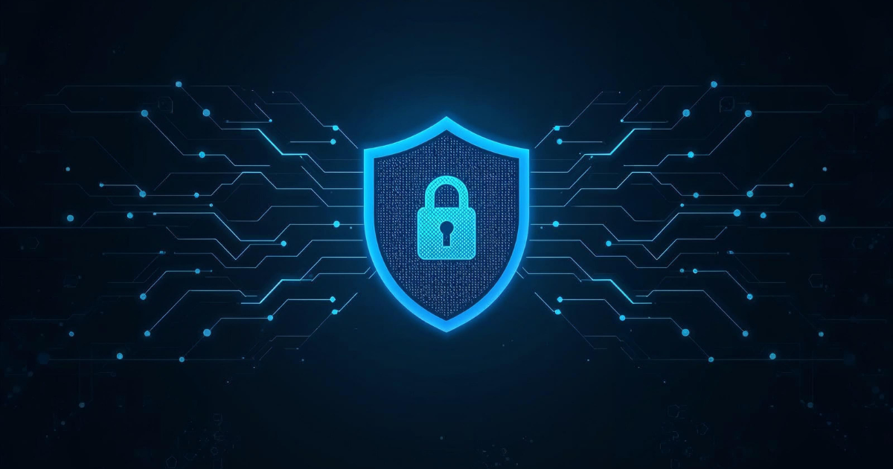

<div align="center">
  
  
  # SafetyLayer
  
  ### Free Client-Side PII Scrubber for AI & LLMs
  
  **Securely mask sensitive data before sending it to ChatGPT, Claude, or DeepSeek.**  
  100% Offline · Open Source · Privacy-First
  
  [](https://github.com/Imran-Ashiq)
  [](LICENSE)
  [](https://nextjs.org/)
  [](https://www.typescriptlang.org/)
  
  [Live Demo](https://safetylayer.com) · [Documentation](#-features) · [Report Bug](https://github.com/Imran-Ashiq/issues)
  
</div>

---

## 🚨 The Problem

Every day, millions of professionals paste **confidential data** into ChatGPT, Claude, and other AI assistants:
- 📧 **Email addresses** from client communications
- 💳 **Credit card numbers** from payment logs
- 📱 **Phone numbers** from customer support tickets
- 🔐 **SSN, API keys, and passwords** from debugging sessions

**Once you paste that data, it's out of your control.**  
AI providers may use your inputs to train models, store them in chat logs, or inadvertently expose them through security breaches.

---

## ✨ The Solution

**SafetyLayer** is a **100% client-side** PII scrubber that runs entirely in your browser. It **detects** and **masks** sensitive information with reversible tokens, so you can safely share data with AI while maintaining privacy.

### How It Works (3 Steps):

```
1. SCRUB    → Paste sensitive data → SafetyLayer detects PII → Replaces with tokens
2. SHARE    → Copy sanitized text with [EMAIL_1], [CC_1] → Send to ChatGPT/Claude
3. RESTORE  → Paste AI's response → SafetyLayer swaps tokens back → Get original data
```

**Example:**
```diff
- Input:  "Contact john.doe@example.com or call (123) 456-7890. Card: 4111-1111-1111-1111"
+ Output: "Contact [EMAIL_1] or call [PHONE_1]. Card: [CC_1]"
```

---

## 🎯 Key Features

### 🛡️ Privacy-First Architecture
- ✅ **100% Offline Processing** – All operations happen in your browser, no server calls
- ✅ **Zero Data Collection** – We never see, store, or transmit your data
- ✅ **Reversible Tokenization** – Swap tokens back to original values anytime
- ✅ **Open Source** – Fully auditable, transparent codebase

### 🔍 Advanced PII Detection
- 📧 **Email Addresses** – RFC 5322 compliant regex
- 💳 **Credit Cards** – Luhn algorithm validation (Visa, MC, Amex, Discover)
- 📱 **Phone Numbers** – US & International formats
- 🆔 **SSN & Passports** – US Social Security Numbers, Passport IDs
- 🔐 **Custom Patterns** – Extensible pattern system

### 🚀 Production-Ready Features
- ⚡ **Smart Copy** – Automatically adds AI safety instructions to clipboard
- 🎨 **Fuzzy Restoration** – Handles AI-modified tokens (e.g., `EMAIL_1` without brackets)
- 📊 **Real-Time Statistics** – Live detection counters and PII breakdown
- 🌓 **Dark Mode** – Seamless light/dark theme support
- ⌨️ **Keyboard Shortcuts** – `Ctrl+Enter` to scrub, `Ctrl+Shift+R` to restore
- 🛡️ **Character Limit Protection** – Prevents browser freezing (100k char limit)
- 📱 **Fully Responsive** – Works on desktop, tablet, and mobile

### 📚 Educational Content
- 📖 **SEO-Optimized Blog** – MDX-powered articles on AI security
- 🎓 **Developer Guides** – Best practices for PII handling
- 📑 **Dynamic Sitemap** – Auto-generated for search engines

---

## 🛠️ Tech Stack

| Category | Technologies |
|----------|-------------|
| **Frontend** | Next.js 16.1 (App Router), React 19, TypeScript 5.7 |
| **Styling** | Tailwind CSS 3.4, shadcn/ui, Lucide Icons |
| **State Management** | Zustand (persistent localStorage) |
| **PII Detection** | Custom regex patterns, Luhn algorithm |
| **Content** | MDX, next-mdx-remote, gray-matter |
| **Syntax Highlighting** | highlight.js, rehype-highlight |
| **Deployment** | Vercel (recommended), Docker-ready |

---

## 📦 Installation

### Prerequisites
- Node.js 18+ or Bun
- Git

### Quick Start

```bash
# 1. Clone the repository
git clone https://github.com/Imran-Ashiq/safetylayer.git
cd safetylayer

# 2. Install dependencies
npm install
# or
bun install

# 3. Run development server
npm run dev
# or
bun dev

# 4. Open browser
# Visit http://localhost:3000
```

### Build for Production

```bash
# Build optimized production bundle
npm run build

# Start production server
npm start
```

---

## 🎮 Usage

### Basic Workflow

1. **Scrub Sensitive Data**
   - Paste your text containing PII into the "Raw Input" panel
   - Click **"Scrub PII"** or press `Ctrl+Enter`
   - SafetyLayer detects and masks all sensitive information

2. **Copy & Share with AI**
   - Click **"Copy"** on the "Safe Output" panel
   - Smart Copy automatically adds AI safety instructions
   - Paste into ChatGPT, Claude, or any AI assistant

3. **Restore Original Data**
   - Paste AI's response (containing tokens) into "Raw Input"
   - Click **"Restore PII"** or press `Ctrl+Shift+R`
   - Get your original sensitive data back

### Keyboard Shortcuts

| Shortcut | Action |
|----------|--------|
| `Ctrl+Enter` / `Cmd+Enter` | Scrub PII from input |
| `Ctrl+Shift+R` / `Cmd+Shift+R` | Restore original values |
| `Ctrl+/` / `Cmd+/` | Show shortcuts help |

---

## 🔒 Security & Privacy

### What We DON'T Do
- ❌ **No Server Processing** – Everything runs client-side
- ❌ **No Data Storage** – We don't save, log, or track your data
- ❌ **No Analytics** – No third-party tracking scripts
- ❌ **No API Calls** – Zero network requests with your data

### What We DO
- ✅ **Browser-Only Processing** – All PII detection happens in JavaScript
- ✅ **Local Storage** – Tokens stored only in your browser's localStorage
- ✅ **Open Source** – Full code transparency for security audits
- ✅ **GDPR/CCPA Compliant** – No personal data leaves your device

### Legal Disclaimer
Processing happens locally in your browser. No data is sent to our servers. Use at your own risk.

---

## 🧪 Advanced Features

### Smart Copy
When you copy sanitized text, SafetyLayer automatically prepends:
```
[System Instruction: The text below contains security tokens like [EMAIL_1], [CC_1]. 
DO NOT remove the brackets or modify the token format in your response.]
```
This ensures AI assistants preserve token formatting.

### Fuzzy Restoration
Even if AI modifies tokens, restoration still works:
- `[EMAIL_1]` → `EMAIL_1` (brackets removed) ✅
- `[EMAIL_1]` → `email_1` (lowercase) ✅
- `[EMAIL_1]` → `**[EMAIL_1]**` (markdown) ✅

### Pattern Customization
Extend detection patterns in `src/lib/patterns/index.ts`:
```typescript
export const PIIPatterns = {
  email: /[a-zA-Z0-9._%+-]+@[a-zA-Z0-9.-]+\.[a-zA-Z]{2,}/g,
  // Add your custom patterns...
};
```

---

## 📝 Blog & SEO

SafetyLayer includes a production-ready MDX blog system:

### Features
- 📄 **Dynamic Blog Posts** – Auto-discovered from `content/blog/*.mdx`
- 🎨 **Documentary-Style Formatting** – Custom components (warning boxes, stats, quotes)
- 🖼️ **Hero Images** – Full support for blog post images
- 🔍 **SEO Optimized** – Meta tags, Open Graph, Twitter Cards, JSON-LD schema
- 🗺️ **Auto-Generated Sitemap** – Updates with new posts automatically

### Add a New Blog Post

1. Create `content/blog/your-post-slug.mdx`:
```mdx
---
title: "Your Post Title"
description: "SEO description"
date: "2026-01-03"
author: "Your Name"
tags: ["AI Security", "Privacy"]
image: "/blog/hero.png"
---

Your content here...
```

2. The post automatically appears at `/blog/your-post-slug`

---

## 🤝 Contributing

Contributions are welcome! Here's how:

1. **Fork the repository**
2. **Create a feature branch** (`git checkout -b feature/amazing-feature`)
3. **Commit changes** (`git commit -m 'Add amazing feature'`)
4. **Push to branch** (`git push origin feature/amazing-feature`)
5. **Open a Pull Request**

### Development Guidelines
- Follow TypeScript best practices
- Use Prettier for code formatting
- Test PII detection thoroughly
- Update documentation for new features

---

## 📄 License

This project is licensed under the **MIT License** - see the [LICENSE](LICENSE) file for details.

---

## 🌟 Acknowledgments

- **shadcn/ui** – Beautiful, accessible UI components
- **Next.js** – Amazing React framework
- **Zustand** – Lightweight state management
- **MDX** – Markdown with JSX superpowers
- **Open Source Community** – For making this possible

---

## 📞 Support & Contact

- 🐛 **Report Issues**: [GitHub Issues](https://github.com/Imran-Ashiq/issues)
- 💬 **Discussions**: [GitHub Discussions](https://github.com/Imran-Ashiq)
- 📧 **Email**: hello@safetylayer.dev
- 🐦 **Twitter**: [@safetylayer](https://twitter.com/safetylayer)

---

<div align="center">
  
  ### ⭐ If SafetyLayer helps you, please star the repo!
  
  Made with ❤️ by [Imran Ashiq](https://github.com/Imran-Ashiq)
  
  **Keep your data safe. Keep your privacy intact.**
  
</div>